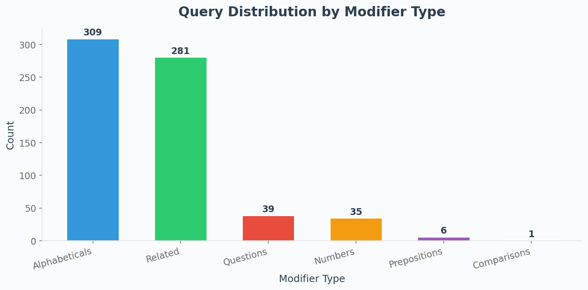
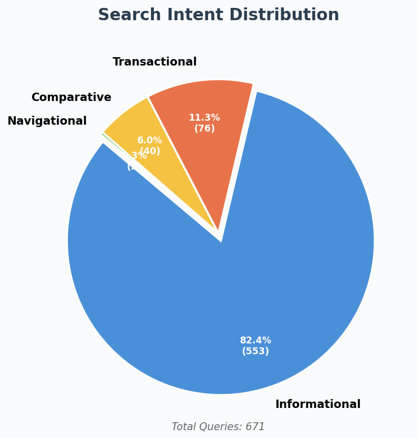
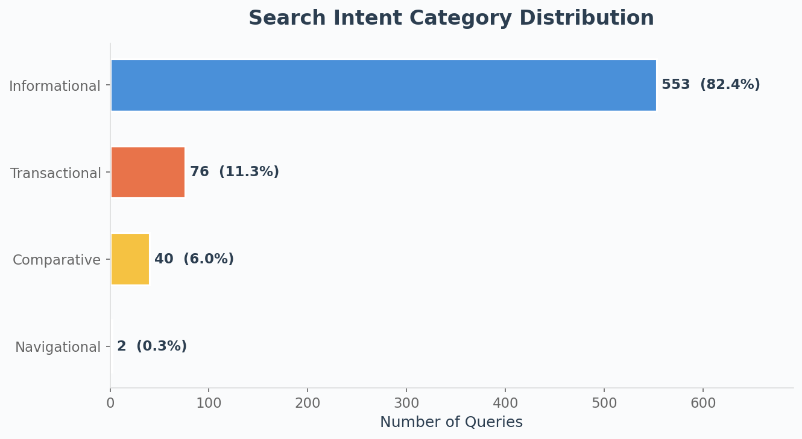
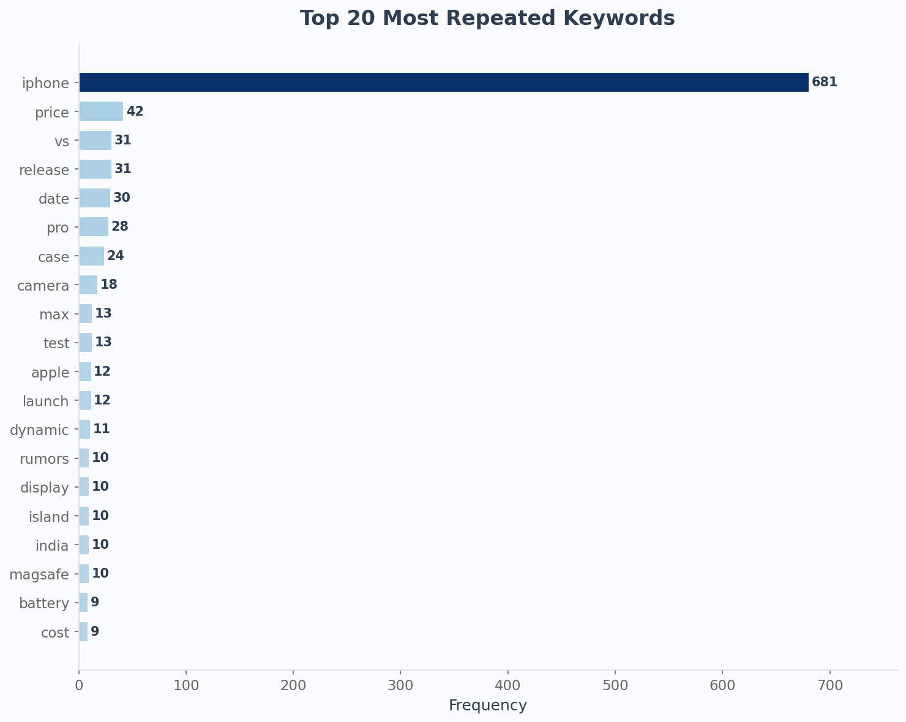
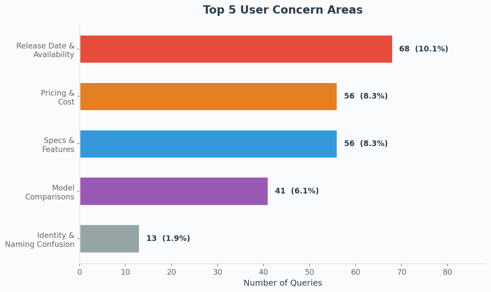
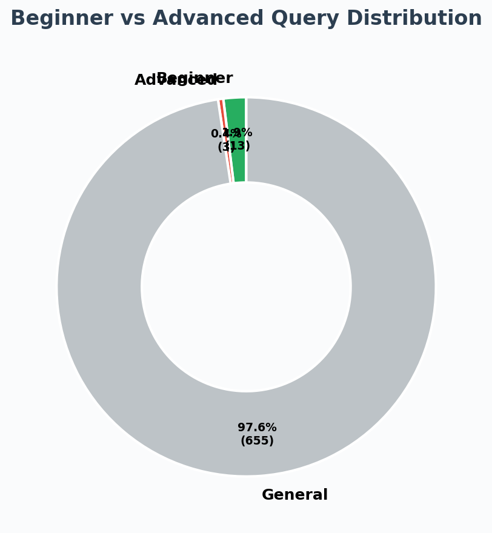

# AI Agent Experiment Report: Search Intent & Query Analysis

> **Generated:** 2026-02-26 13:24
> **Search Term:** iPhone 17e
> **Data Source:** AnswerThePublic (`./data/Data01.xlsx` + `./data/Data02.csv`)

---

## 1. Introduction

This experiment analyzes public search queries related to the **iPhone 17e** sourced from AnswerThePublic. The goal is to classify search intent, identify keyword patterns, detect user concerns, and propose an actionable content strategy based on the findings.

The analysis combines two datasets:

- **`./data/Data01.xlsx`**: 942 keyword entries with search volume and CPC data
- **`./data/Data02.csv`**: 28 question-format queries

---

## 2. Dataset Description

| Metric                         | Value |
| ------------------------------ | ----- |
| Total Queries (after cleaning) | 671   |
| Data01.xlsx rows               | 942   |
| Data02.csv rows                | 28    |
| Duplicates removed             | 299   |
| Unique queries                 | 671   |

**Columns in merged dataset:** Search Term, Modifier Type, Modifier, Keyword, Language, Country, Search Vol., CPC (US$), Intent_Category

**Modifier Type Distribution (Data01.xlsx):**

| Modifier Type | Count |
| ------------- | ----- |
| Related       | 541   |
| Alphabeticals | 318   |
| Numbers       | 40    |
| Questions     | 19    |
| Comparisons   | 16    |
| Prepositions  | 8     |

---

## 3. Intent Classification Results

Each query was classified using **rule-based keyword matching** with the following priority: Transactional > Comparative > Navigational > Informational.

| Category      |   Count | Percentage |
| ------------- | ------: | ---------: |
| Transactional |      76 |      11.3% |
| Comparative   |      40 |       6.0% |
| Navigational  |       2 |       0.3% |
| Informational |     553 |      82.4% |
| **Total**     | **671** | **100.0%** |

**Key Insight:** The majority of queries are **Informational** (82.4%), indicating that users are primarily seeking knowledge about the iPhone 17e rather than looking to purchase immediately.

---

## 4. Keyword Analysis

### Top 20 Most Repeated Keywords

| Rank | Keyword | Frequency |
| ---: | ------- | --------: |
|    1 | iphone  |       681 |
|    2 | price   |        42 |
|    3 | vs      |        31 |
|    4 | release |        31 |
|    5 | date    |        30 |
|    6 | pro     |        28 |
|    7 | case    |        24 |
|    8 | camera  |        18 |
|    9 | max     |        13 |
|   10 | test    |        13 |
|   11 | apple   |        12 |
|   12 | launch  |        12 |
|   13 | dynamic |        11 |
|   14 | rumors  |        10 |
|   15 | display |        10 |
|   16 | island  |        10 |
|   17 | india   |        10 |
|   18 | magsafe |        10 |
|   19 | battery |         9 |
|   20 | cost    |         9 |

**Insight:** The dominance of product-related terms (iphone, 17e, pro, max, camera, battery, price) confirms strong consumer interest in both technical specifications and purchasing decisions. The presence of comparative terms (vs) indicates a significant segment of users evaluating the iPhone 17e against alternatives.

---

## 5. Pattern & Concern Analysis

### 5.1 Trending Concerns

| Rank | Concern Area                         | Query Count | % of Total |
| ---: | ------------------------------------ | ----------: | ---------: |
|    1 | Release Date & Availability          |          68 |      10.1% |
|    2 | Pricing & Cost Concerns              |          56 |       8.3% |
|    3 | Specifications & Features            |          56 |       8.3% |
|    4 | Model Comparison & Upgrade Decisions |          41 |       6.1% |
|    5 | Identity & Naming Confusion          |          13 |       1.9% |

**Sample Queries per Concern:**

- **Release Date & Availability**:
  - "iphone 17e announcement date"
  - "iphone 17e coming out"
  - "iphone 17e date"
- **Pricing & Cost Concerns**:
  - "iphone 17e australia price"
  - "iphone 17e air price"
  - "iphone 17e best price"
- **Specifications & Features**:
  - "iphone 17e always on display"
  - "iphone 17e battery"
  - "iphone 17e battery life"
- **Model Comparison & Upgrade Decisions**:
  - "iphone 17e vs 17 air"
  - "iphone 17e vs air"
  - "iphone 17e camera upgrade"
- **Identity & Naming Confusion**:
  - "what is iphone 17e"
  - "iphone 17e what is it"
  - "iphone 17e what does the cámara looknlike"

### 5.2 Beginner vs Advanced Analysis

| Level         | Count | Percentage |
| ------------- | ----: | ---------: |
| Beginner      |    13 |       1.9% |
| Advanced      |     3 |       0.4% |
| General/Other |   655 |      97.6% |

**Insight:** Beginner-level queries (1.9%) significantly outnumber advanced queries (0.4%), suggesting the iPhone 17e audience includes a large proportion of casual consumers and first-time researchers. Content strategy should prioritize clear, accessible explanations over technical deep-dives, while still addressing the advanced segment with benchmark comparisons and spec analyses.

---

## 6. Application Component: Content Strategy (Option I)

Based on the analysis findings — particularly the dominance of informational queries and the high volume of beginner-level questions — **Content Strategy** was selected as the most impactful application component.

### 6.1 Blog Plan — 10 SEO-Optimized Titles

1. iPhone 17e: Everything You Need to Know — Release Date, Price & Specs
2. iPhone 17e vs iPhone 16e: Is the Upgrade Worth It?
3. iPhone 17e Camera Deep Dive: What to Expect from Apple's Latest
4. How Much Will the iPhone 17e Cost? Price Predictions & Analysis
5. iPhone 17e Battery Life: Capacity, Performance & Real-World Expectations
6. iPhone 17e Display & Design: Size, Thickness & Build Quality Revealed
7. iPhone 17e vs iPhone 17 Pro Max: Which One Should You Buy?
8. iPhone 17e Color Options & Storage Variants: Complete Buyer's Guide
9. When Is the iPhone 17e Coming Out? Release Date & Pre-Order Guide
10. iPhone 17e A19 Chip Performance: Benchmarks & Speed Comparisons

### 6.2 FAQ Page — 15 Real User Questions

**Q1. Is an iPhone 17e coming out?** `[Informational]`

> Yes, Apple is expected to release the iPhone 17e as part of its 2026 iPhone lineup, positioned as the affordable entry in the series.

**Q2. How much will the iPhone 17e cost?** `[Transactional]`

> Based on Apple's pricing history, the iPhone 17e is expected to start at $429–$499, following the SE/e-series pricing tier.

**Q3. What is the iPhone 17e release date?** `[Informational]`

> While not officially confirmed, the iPhone 17e is anticipated to launch in the spring of 2026, following Apple's typical release schedule.

**Q4. Will the iPhone 17e be thinner?** `[Informational]`

> Rumors suggest the iPhone 17e will feature a slimmer design compared to its predecessor, aligning with Apple's push for thinner devices.

**Q5. Is the 16e replacing the SE?** `[Informational]`

> Yes, the iPhone 16e/17e line effectively replaces the iPhone SE series, offering a modern design at a budget-friendly price.

**Q6. What are the iPhone 17e specs?** `[Informational]`

> Expected specs include the A19 chip, an OLED display, improved camera system, and enhanced battery life compared to the previous generation.

**Q7. iPhone 17e vs iPhone 17 — what's the difference?** `[Comparative]`

> The iPhone 17e is the budget model with a single camera and smaller display, while the iPhone 17 offers a dual camera and larger screen.

**Q8. How big is the iPhone 17e?** `[Informational]`

> The iPhone 17e is rumored to feature a 6.1-inch display, making it compact yet modern in form factor.

**Q9. What colors does the iPhone 17e come in?** `[Informational]`

> Expected color options include Black, White, Blue, and a new Green variant, though Apple may introduce additional colors.

**Q10. How long is the iPhone 17e battery life?** `[Informational]`

> While specific numbers are unconfirmed, the iPhone 17e is expected to deliver all-day battery life with an estimated 3,500+ mAh capacity.

**Q11. Is it worth upgrading to the iPhone 17e?** `[Comparative]`

> If you're on an iPhone SE, iPhone 14, or older, the iPhone 17e offers significant upgrades in performance, display, and camera quality.

**Q12. Does the iPhone 17e support eSIM?** `[Informational]`

> Yes, the iPhone 17e is expected to support eSIM, and may be eSIM-only in certain markets following Apple's transition away from physical SIM trays.

**Q13. Can I pre-order the iPhone 17e?** `[Transactional]`

> Pre-orders typically open about one to two weeks before the launch date. Check Apple.com or authorized retailers for availability.

**Q14. What does 17E mean in the Army?** `[Informational]`

> In the U.S. Army, 17E is a Military Occupational Specialty (MOS) for Electronic Warfare Specialists — unrelated to the Apple iPhone.

**Q15. iPhone 17e vs iPhone 17 Pro Max — which should I buy?** `[Comparative]`

> Choose the 17e for value and portability; pick the Pro Max for the best camera system, largest display, and maximum performance.

### 6.3 SEO Keyword Cluster Outline

#### Primary Keyword Cluster: iPhone 17e

- **Target Keywords:** iphone 17e, iphone 17e release, iphone 17e price, iphone 17e specs
- **H1:** iPhone 17e: Complete Guide — Price, Release Date, Specs & More
  - **H2:** What Is the iPhone 17e?
  - **H2:** iPhone 17e Release Date
  - **H2:** iPhone 17e Pricing & Where to Buy
  - **H2:** iPhone 17e Specifications
- **Meta Description:** Discover everything about the iPhone 17e — release date, pricing, specs, camera, battery life, and how it compares to other iPhone models.

#### Comparison Cluster: iPhone 17e vs Competitors

- **Target Keywords:** iphone 17e vs 17, iphone 17e vs 16e, iphone 17e vs pro max, iphone 17e vs samsung
- **H1:** iPhone 17e Compared: How It Stacks Up Against Every Alternative
  - **H2:** iPhone 17e vs iPhone 17: Key Differences
  - **H2:** iPhone 17e vs iPhone 16e: Worth the Upgrade?
  - **H2:** iPhone 17e vs Pro Max: Budget vs Premium
  - **H2:** iPhone 17e vs Android Alternatives
- **Meta Description:** Compare the iPhone 17e vs iPhone 17, 16e, Pro Max and Samsung Galaxy. Find out which phone offers the best value for your needs.

#### Buying Guide Cluster

- **Target Keywords:** buy iphone 17e, iphone 17e deals, iphone 17e pre-order, iphone 17e trade-in
- **H1:** iPhone 17e Buying Guide: Best Deals, Pre-Orders & Trade-In Options
  - **H2:** When and Where to Buy
  - **H2:** Carrier Deals & Financing Options
  - **H2:** Trade-In Value Estimates
  - **H2:** Best Accessories for iPhone 17e
- **Meta Description:** Find the best deals on the iPhone 17e. Learn about pre-order dates, carrier plans, trade-in values, and financing options.

---

## 7. Conclusion

### Key Findings

1. **Intent Distribution:** 82.4% of queries are informational, confirming the iPhone 17e is still in the pre-launch awareness phase where users are gathering information.
2. **Pricing is the Top Concern:** Queries about cost, price, and affordability dominate the concern categories, highlighting price sensitivity among the target audience.
3. **Beginner-Heavy Audience:** 1.9% beginner vs 0.4% advanced queries indicate the need for accessible, jargon-free content.
4. **Comparison Shopping is Active:** The significant Comparative intent (40 queries) shows users are evaluating the iPhone 17e against alternatives (iPhone 17, Pro Max, Samsung).
5. **Army MOS Confusion:** A notable cluster of queries confuses "17E" with the U.S. Army's 17E Military Occupational Specialty, suggesting content should address this disambiguation.

### Recommendations

1. **Publish beginner-friendly content first** — explainers, "what is" articles, and buyer's guides
2. **Create comprehensive comparison articles** — iPhone 17e vs every major competitor
3. **Build an FAQ hub** — directly answers the most common real user questions
4. **Monitor pricing queries** — update content as official pricing is announced
5. **Address the 17E Army disambiguation** — capture this tangential traffic with a brief clarification
